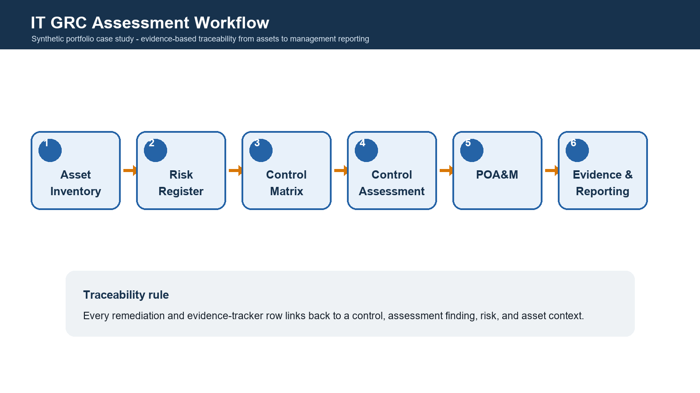
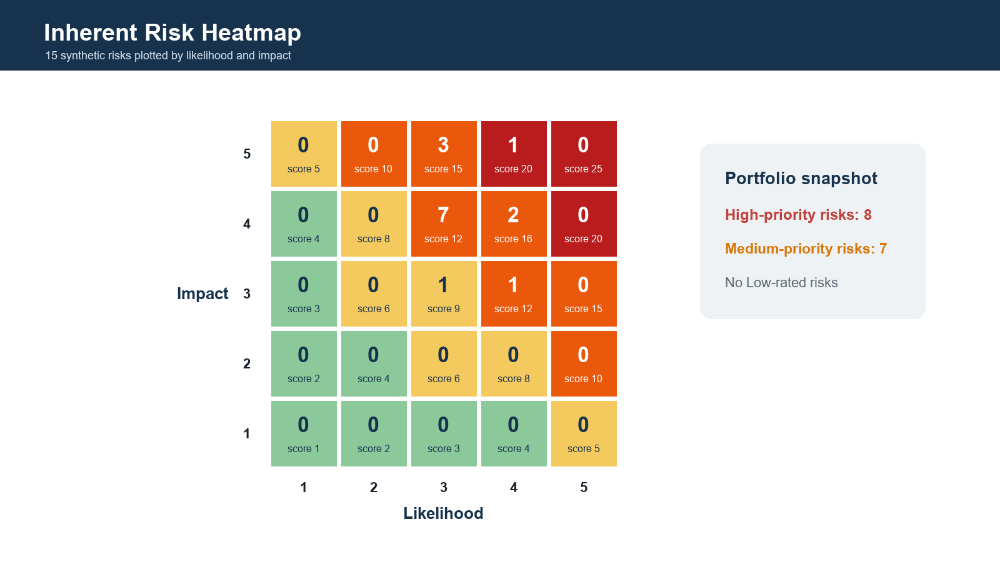
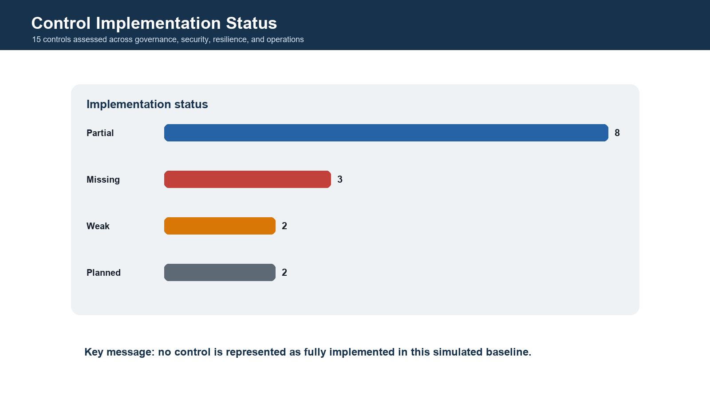
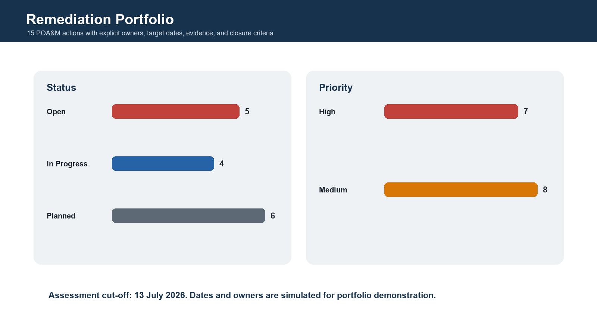

# IT GRC Risk & Control Assessment Case Study

A synthetic, evidence-led IT Governance, Risk, and Compliance portfolio project for an internal academic services system.

The project demonstrates a complete assessment chain:

```text
Asset inventory -> Risk register -> Control matrix -> Control assessment
-> Gap analysis -> POA&M -> Evidence tracker -> Management reporting
```

It uses public NIST, CIS, ISACA, ISO, and Indonesian legal references for methodology and context. It does **not** claim to be a real audit, certification assessment, legal opinion, or production engagement.

## Project Snapshot

| Area | Result |
|---|---:|
| Assets in scope | 12 |
| High-sensitivity assets | 6 |
| High-criticality assets | 7 |
| Risks assessed | 15 |
| High-priority risks | 8 |
| Controls assessed | 15 |
| High-severity findings | 7 |
| Evidence sets partial | 9 |
| Evidence sets unavailable | 6 |
| POA&M actions | 15 |
| Open actions | 5 |
| Actions in progress | 4 |
| Planned actions | 6 |
| CSV rows validated | 87 |

Assessment cut-off: **13 July 2026**.

## Executive Result

The simulated control environment is not presented as compliant or audit-ready.

- `R-001` Privileged Access Management has the highest residual risk score at 15.
- Eight risks have residual scores of 12 or higher.
- Five controls are Missing or Weak, eight are Partial, and two are Planned.
- No control is represented as fully evidenced in the baseline.
- Every finding has a linked remediation action, owner, target date, evidence requirement, and closure criterion.

The management conclusion is **remediation required**, followed by control re-testing.

## Workflow



## Risk and Control Posture

### Risk heatmap



### Control implementation status



### Remediation portfolio



## Main Deliverables

| Artifact | Purpose |
|---|---|
| [`docs/01_case_brief.md`](docs/01_case_brief.md) | Defines the synthetic business problem, scope, stakeholders, and success criteria. |
| [`data/asset_inventory.csv`](data/asset_inventory.csv) | Defines 12 in-scope assets and their sensitivity, criticality, owner, and dependencies. |
| [`data/risk_register.csv`](data/risk_register.csv) | Records 15 risks with threat, vulnerability, impact, inherent risk, existing controls, and residual risk. |
| [`data/control_matrix.csv`](data/control_matrix.csv) | Maps 15 controls to risks, assets, evidence, owners, frequencies, and public framework concepts. |
| [`data/control_assessment_results.csv`](data/control_assessment_results.csv) | Documents simulated test procedures, evidence status, findings, severity, and recommendations. |
| [`docs/07_gap_analysis.md`](docs/07_gap_analysis.md) | Converts assessment findings into current-vs-target gaps. |
| [`data/remediation_plan_poam.csv`](data/remediation_plan_poam.csv) | Tracks actions, owners, target dates, dependencies, evidence, and closure criteria. |
| [`data/evidence_tracker.csv`](data/evidence_tracker.csv) | Connects every control to required evidence without fabricating evidence files. |
| [`sql/01_create_tables.sql`](sql/01_create_tables.sql) | Creates the validated SQLite schema, indexes, and management views. |
| [`sql/03_grc_monitoring_queries.sql`](sql/03_grc_monitoring_queries.sql) | Provides eight management and traceability queries. |
| [`docs/10_management_summary.md`](docs/10_management_summary.md) | Presents the executive conclusion, KPIs, priority findings, and decision sequence. |
| [`output/pdf/IT_GRC_Project_Summary.pdf`](output/pdf/IT_GRC_Project_Summary.pdf) | Four-page recruiter and interview summary. |

## Evidence Integrity

This repository does not contain real access exports, approvals, logs, tickets, backup results, vulnerability reports, or management sign-offs.

The evidence tracker explicitly records:

```text
evidence_repository_path = Not collected - synthetic case study
```

This is intentional. The project demonstrates how evidence should be indexed, assigned, monitored, and linked to remediation without presenting invented artifacts as real audit evidence.

## SQL Monitoring Questions

The SQL layer answers practical management questions:

1. How many risks exist at each priority level?
2. Which risks retain a residual score of 12 or higher?
3. Which controls cannot be fully evidenced?
4. Which POA&M items are closest to their target dates?
5. Which owners carry the largest remediation workload?
6. Which actions are due within 60 days of the assessment cut-off?
7. Can each risk be traced through control, finding, remediation, and evidence?
8. What is the compact management KPI position?

## Run and Validate

Install dependencies:

```bash
python -m pip install -r requirements.txt
```

Generate the evidence tracker, visuals, and PDF:

```bash
python scripts/generate_artifacts.py
```

Run validation:

```bash
python scripts/validate_project.py
```

Expected result:

```text
validation=passed
csv_rows=87
relationship_checks=passed
risk_score_checks=passed
sql_schema_and_queries=passed
secret_scan=passed
```

See [`RUNNING.md`](RUNNING.md) for detailed instructions.

## Public Methodology Sources

| Source | Use in this project |
|---|---|
| [NIST Cybersecurity Framework 2.0](https://www.nist.gov/cyberframework) | Governance, Identify, Protect, Detect, Respond, and Recover outcomes. |
| [NIST SP 800-30 Rev. 1](https://csrc.nist.gov/pubs/sp/800/30/r1/final) | Risk assessment concepts and risk-informed response. |
| [NIST SP 800-53 Rev. 5](https://csrc.nist.gov/pubs/sp/800/53/r5/upd1/final) | Security and privacy control-family context. |
| [NIST SP 800-53A Rev. 5](https://csrc.nist.gov/pubs/sp/800/53/a/r5/final) | Evidence-based control assessment method. |
| [ISO/IEC 27001:2022 public overview](https://www.iso.org/standard/27001) | Public ISMS, risk-management, confidentiality, integrity, availability, and continual-improvement concepts. |
| [CIS Critical Security Controls v8.1](https://www.cisecurity.org/controls) | Practical safeguard themes such as asset, access, log, recovery, and vulnerability management. |
| [ISACA COBIT resources](https://www.isaca.org/resources/cobit) | Governance, ownership, monitoring, and management-reporting concepts. |
| [Indonesia Law No. 27 of 2022](https://peraturan.bpk.go.id/Details/229798/uu-no-27-tahun-2022) | Personal-data protection context. |

The project uses public, high-level ISO/IEC 27001 concepts only. It does not reproduce copyrighted standard text or claim clause-level conformity.

## Repository Structure

```text
it-grc-risk-control-assessment-case-study/
|-- README.md
|-- RUNNING.md
|-- requirements.txt
|-- data/
|   |-- asset_inventory.csv
|   |-- risk_register.csv
|   |-- control_matrix.csv
|   |-- control_assessment_results.csv
|   |-- remediation_plan_poam.csv
|   `-- evidence_tracker.csv
|-- docs/
|   |-- 01_case_brief.md
|   |-- 02_methodology_and_source_mapping.md
|   |-- 03_scope_and_asset_inventory.md
|   |-- 04_risk_register.md
|   |-- 05_control_matrix.md
|   |-- 06_control_assessment_results.md
|   |-- 07_gap_analysis.md
|   |-- 08_remediation_plan_poam.md
|   |-- 09_evidence_tracker.md
|   |-- 10_management_summary.md
|   `-- 11_limitations_and_assumptions.md
|-- evidence/
|   `-- README.md
|-- sql/
|   |-- 01_create_tables.sql
|   |-- 02_load_data.md
|   `-- 03_grc_monitoring_queries.sql
|-- scripts/
|   |-- generate_artifacts.py
|   `-- validate_project.py
|-- assets/
|   |-- grc_workflow.png
|   |-- risk_heatmap.png
|   |-- control_gap_summary.png
|   `-- remediation_status_summary.png
`-- output/pdf/
    `-- IT_GRC_Project_Summary.pdf
```

## Scope Boundary

This is a self-directed synthetic case study. It does not represent:

- a real organization,
- a legal or regulatory conclusion,
- an ISO/IEC 27001 certification audit,
- a COBIT capability assessment,
- a penetration test,
- professional audit work experience,
- or a production GRC application.

Detailed limitations are documented in [`docs/11_limitations_and_assumptions.md`](docs/11_limitations_and_assumptions.md).

## Portfolio Positioning

The project is designed to demonstrate junior-level capability in:

- IT risk identification and scoring,
- control design and mapping,
- assessment procedures and evidence reasoning,
- gap analysis and remediation planning,
- SQL-based GRC monitoring,
- management reporting,
- and honest communication of limitations.
