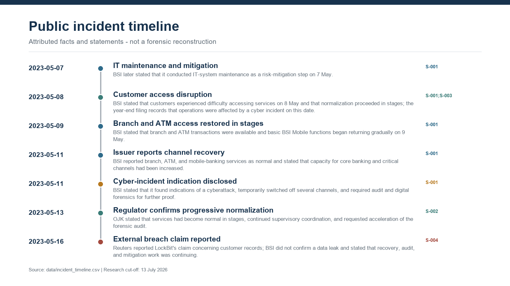
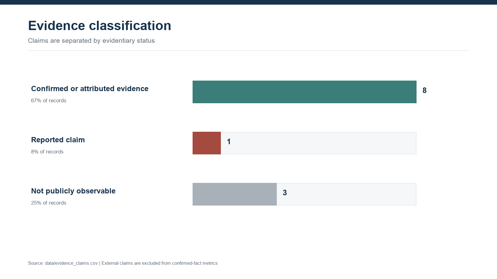
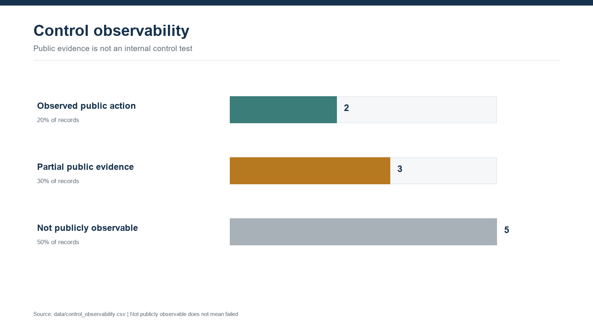
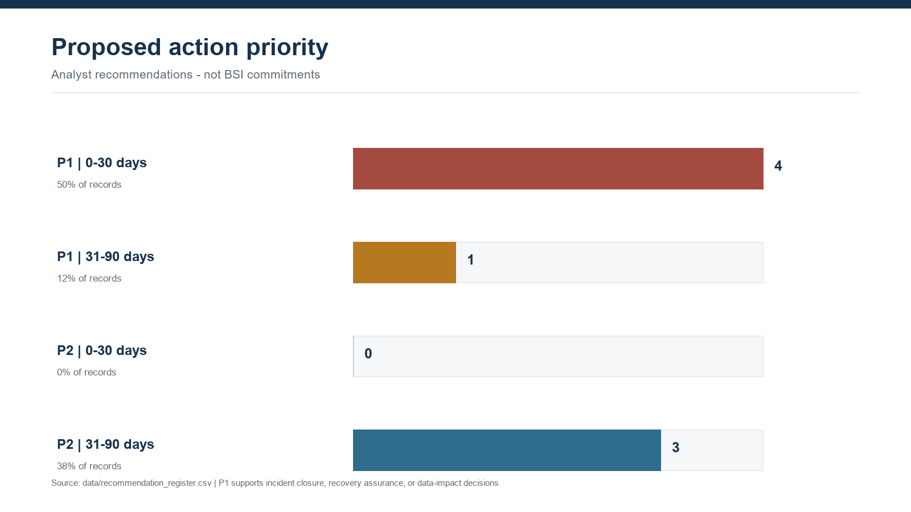

# Public-Evidence Banking Cyber Incident and IT GRC Assessment

An independent portfolio project that reconstructs the May 2023 Bank Syariah Indonesia (BSI) service disruption from public evidence and evaluates what can - and cannot - be concluded about IT governance, cyber resilience, incident response, recovery, and data protection.

> **Important:** This is not an audit of BSI, is not affiliated with BSI or OJK, and uses no internal or confidential data. It assesses public evidence only. A control marked `Not publicly observable` is not classified as failed.

## Why this project is credible

- The incident is real and acknowledged in BSI's official disclosures.
- The service-recovery timeline uses an official BSI press release and an OJK supervisory update.
- The year-end incident statement comes from BSI's audited 2023 financial statements.
- Regulatory expectations come from POJK No. 11/POJK.03/2022 and SEOJK No. 29/SEOJK.03/2022.
- A Reuters report is used only to document a third-party LockBit claim, not to convert that claim into a verified fact.
- Every analytical record contains one or more `source_id` values.
- Unknown facts stay unknown; the project does not invent a root cause, attack vector, affected-record count, or control test result.

## Case in plain language

BSI services were disrupted on 8 May 2023. BSI reported staged restoration and said on 11 May that branch, ATM, and mobile-banking services were normal. BSI also disclosed indications of a cyberattack and said audit and digital forensics were required. On 13 May, OJK reported progressive normalization and requested acceleration of the forensic audit. BSI's 2023 financial statements later recorded the cyber incident and stated that corrective action and cybersecurity enhancements had been performed.

Public reporting also carried a LockBit data-exposure claim. This project records it as a **reported third-party claim**, because the reviewed primary sources do not publish a verified affected-record inventory or final forensic conclusion.

## Analytical outputs

### Incident timeline



### Evidence classification



### Control observability



### Proposed action priorities



## Repository map

| Artifact | Purpose |
|---|---|
| [`data/source_catalog.csv`](data/source_catalog.csv) | Nine public sources with publisher, date, locator, URL, authority level, and intended use. |
| [`data/incident_timeline.csv`](data/incident_timeline.csv) | Seven dated events reconstructed from BSI, OJK, the audited filing, and Reuters. |
| [`data/evidence_claims.csv`](data/evidence_claims.csv) | Twelve claims classified as public fact, issuer/regulator statement, reported claim, or not publicly observable. |
| [`data/control_observability.csv`](data/control_observability.csv) | Ten control domains mapped to Indonesian banking rules and public evidence. |
| [`data/recommendation_register.csv`](data/recommendation_register.csv) | Eight analyst proposals with priority, horizon, evidence basis, references, deliverable, and ownership model. |
| [`docs/01_scope_and_method.md`](docs/01_scope_and_method.md) | Scope boundary, research method, evidence hierarchy, and success criteria. |
| [`docs/02_incident_timeline.md`](docs/02_incident_timeline.md) | Human-readable chronology and reconciliation of BSI and OJK recovery language. |
| [`docs/03_evidence_register.md`](docs/03_evidence_register.md) | Claim-by-claim evidence interpretation and confidence rules. |
| [`docs/04_control_observability_assessment.md`](docs/04_control_observability_assessment.md) | GRC assessment that avoids treating missing public disclosure as a failed internal control. |
| [`docs/05_recommendation_register.md`](docs/05_recommendation_register.md) | Prioritized actions, proposed evidence, owners, and validation criteria. |
| [`docs/06_interview_walkthrough.md`](docs/06_interview_walkthrough.md) | A concise way to explain the project in an IT Officer or IT GRC interview. |
| [`docs/07_limitations_and_ethics.md`](docs/07_limitations_and_ethics.md) | Legal, ethical, evidentiary, and analytical limitations. |
| [`sql/01_create_tables.sql`](sql/01_create_tables.sql) | SQLite schema and integrity constraints. |
| [`sql/02_analysis_queries.sql`](sql/02_analysis_queries.sql) | Evidence coverage, timeline, observability, and recommendation queries. |
| [`output/pdf/Public_Evidence_Banking_Cyber_Incident_GRC_Assessment.pdf`](output/pdf/Public_Evidence_Banking_Cyber_Incident_GRC_Assessment.pdf) | Five-page recruiter and interview summary. |

## Method

```text
Public source collection
        |
        v
Source authority and claim classification
        |
        v
Event timeline and conflicting-statement reconciliation
        |
        v
Regulatory control mapping
        |
        v
Public observability assessment
        |
        v
Evidence-based recommendations and management reporting
```

The project deliberately assesses **observability**, not actual internal-control effectiveness. A public source can prove that an action was announced or observed; it normally cannot prove that a control was designed correctly, operated consistently, and passed independent testing.

## Key findings

- The disruption and cyber-incident status are supported by BSI's official disclosures and year-end filing.
- BSI and OJK provide evidence of service recovery, forensic work, supervisory coordination, and public communication.
- Public evidence does not establish the final forensic root cause, initial access vector, verified affected-data population, or results of internal control testing.
- Of ten assessed control domains, two show an observable public action, three have partial public evidence, and five are not publicly observable.
- The highest-priority analyst proposals focus on forensic closure, recovery metrics, ransomware scenario testing, and personal-data impact assessment.

## Source hierarchy

1. Primary issuer and regulator disclosures.
2. Audited issuer filing.
3. Binding Indonesian regulations and official technical standards.
4. Reputable independent reporting for third-party claims only.

The complete source list is in [`data/source_catalog.csv`](data/source_catalog.csv). Core sources include:

- [BSI service recovery and cyber-incident indication](https://ir.bankbsi.co.id/newsroom/1a92cc8ca2_4364ce956d.pdf)
- [OJK supervisory update, 13 May 2023](https://www.ojk.go.id/id/berita-dan-kegiatan/siaran-pers/Documents/Pages/Operasional-Bank-Syariah-Indonesia-Kembali-Normal-Masyarakat-Diminta-Tenang/SP%20-%20OPERASIONAL%20BANK%20SYARIAH%20INDONESIA%20KEMBALI%20NORMAL%20MASYARAKAT%20DIMINTA%20TENANG.pdf)
- [BSI audited financial statements 2023, Note 47(f)](https://ir.bankbsi.co.id/misc/Laporan-Keuangan/Tahun-Laporan-2023/FY-2023.pdf)
- [POJK No. 11/POJK.03/2022](https://ojk.go.id/id/regulasi/Documents/Pages/Penyelenggaraan-Teknologi-Informasi-Oleh-Bank-Umum/POJK%2011%20-%2003%20-%202022.pdf)
- [SEOJK No. 29/SEOJK.03/2022](https://www.ojk.go.id/id/regulasi/Documents/Pages/Ketahanan-dan-Keamanan-Siber-Bagi-Bank-Umum/SEOJK%2029%20SEOJK.03%202022.pdf)
- [Indonesia Personal Data Protection Law](https://peraturan.bpk.go.id/Details/229798/uu-no-27-tahun-2022)
- [NIST SP 800-61 Rev. 3](https://csrc.nist.gov/pubs/sp/800/61/r3/final)
- [NIST SP 800-184](https://csrc.nist.gov/pubs/sp/800/184/final)

## Reproduce and validate

```powershell
python -m pip install -r requirements.txt
python scripts/generate_artifacts.py
python scripts/validate_project.py
```

See [`RUNNING.md`](RUNNING.md) for Windows-specific instructions and expected output.

## Skills demonstrated

- Open-source evidence collection and source evaluation
- Incident timeline reconstruction
- IT GRC and regulatory control mapping
- Claim confidence and uncertainty management
- SQL data modeling and monitoring queries
- Remediation prioritization and evidence design
- Executive reporting and audit-ready documentation

## Honest boundary

This project does not prove that BSI failed or passed any specific control. It demonstrates how an analyst can turn a real public incident into a traceable, cautious, and decision-useful GRC assessment without fabricating confidential evidence.
